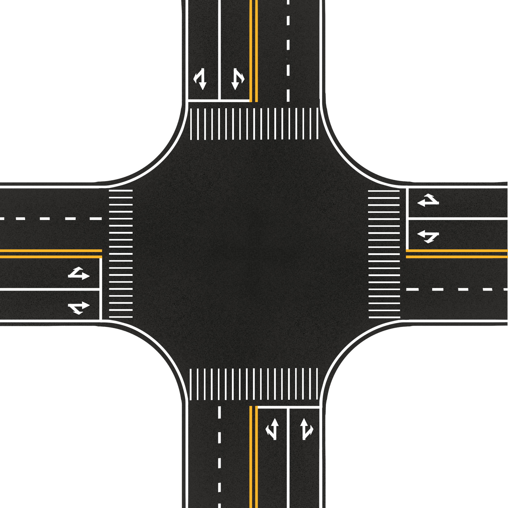

# 🚦 TrafficLight - Akıllı Trafik Işığı Simülasyonu

JavaFX ile geliştirilmiş, araç yoğunluğuna göre akıllı trafik ışığı kontrolü sağlayan interaktif bir simülasyon sistemidir. Proje, dört yönlü bir kavşakta araç hareketlerini, ışık sürelerini ve yoğunluğu gerçek zamanlı olarak yönetir ve görselleştirir.

---

## 📸 Ekran Görüntüsü



---

## 🧠 Temel Özellikler

* ✅ Araç yoğunluğuna göre dinamik yeşil ışık süresi belirleme
* ✅ Gerçek zamanlı ışık, yoğunluk ve istatistik görselleştirme
* ✅ Dönüş animasyonları (sağ, sol, düz)
* ✅ Araç türleri (araba, kamyon, minibüs)
* ✅ Gerçek zamanlı çakışma kontrolü
* ✅ Kullanıcı tarafından giriş yapılabilir trafik verileri
* ✅ Modüler ve genişletilebilir yapı

---

## 💠 Teknolojiler

* **Java 21**
* **JavaFX 21**
* **Maven** (bağımlılık yönetimi için)
* **MVC mimarisi**

---

## 🗂️ Proje Yapısı

```
src/
├── main/
│   ├── java/
│   │   ├── com.traffic.controller    # Simülasyon mantığı ve kontrol katmanı
│   │   ├── com.traffic.model         # Enum ve temel model sınıfları
│   │   ├── com.traffic.view          # JavaFX UI sınıfları
│   │   ├── com.traffic.factory       # Araç üretimi (Factory Pattern)
│   │   └── com.traffic.util          # Sabitler ve yardımcı sınıflar
│   └── resources/
│       ├── assets/icons/vehicles     # Araç ikonları (PNG)
│       ├── assets/map                # Yol haritası
│       └── styles.css                # (Opsiyonel) UI stil dosyası
```

---

## 🚀 Kurulum ve Çalıştırma

### Gereksinimler

* [Java 21+](https://adoptium.net/)
* [JavaFX SDK 21+](https://gluonhq.com/products/javafx/)
* [Maven](https://maven.apache.org/)

### 1. JavaFX Ayarları

IDE’ye göre JavaFX SDK'yı tanımlayın (IntelliJ örneği):

```
--module-path "C:\javafx-sdk-21.0.7\lib" --add-modules javafx.controls
```

### 2. Maven ile Derleme ve Çalıştırma

```bash
mvn clean javafx:run
```

---

## ⚙️ Kullanım

1. Sol panelden yönlere ait araç sayılarını girin.
2. "Start" butonuna basarak simülasyonu başlatın.
3. "Pause" veya "Reset" ile kontrol sağlayın.
4. İstatistikler ve yoğunluk grafiklerini takip edin.

---

## 📊 Genişletme Fikirleri

* ⛔ Kırmızı ışıkta geçen araçların cezalandırılması
* 🧠 ML tabanlı trafik tahmin algoritması
* 🌐 Harici trafik verisi entegrasyonu (API)
* 📈 Grafiksel trafik analiz raporları

---

## 👨‍💻 Geliştirici

**Erdal Gümüş**
🔗 [github.com/erdalgumuss](https://github.com/erdalgumuss)

---Yapılanlar:
Bu projede sıfırdan gerçekçi ve modüler bir JavaFX tabanlı akıllı trafik ışığı simülasyonu inşa ettik. Neler yaptık, bir bakalım:

MVC yapısını takip ettik. Model, Controller ve View katmanlarını net bir şekilde ayırdık.

Trafik ışıkları dinamik sürelerle çalışıyor. Araç yoğunluğuna göre yeşil süreler otomatik hesaplanıyor.

Araç üretimi gerçekçi. Her yön için rastgele araçlar oluşturuluyor (araba, kamyon, van) ve her biri bir şerit ve dönüş yönü alıyor.

Simülasyon motoru saniye bazlı çalışıyor. Işıklar sırasıyla yeşil oluyor, araçlar sırayla çıkıyor.

Animasyonlar eklendi: Araçlar doğuyor, hareket ediyor, dönüşlerde yumuşak eğrilerle dönüyor.

UI paneli kullanımı kolay: Araç yoğunlukları giriliyor, görsel yoğunluk çubukları ve sayaçlar anlık güncelleniyor.

İstatistikler gerçek zamanlı takip ediliyor: Geçen araç sayısı, ortalama bekleme süresi vs.

🧱 Neleri Düzenlememiz Gerekiyor?
Araçlar beklenmedik yerlerde doğabiliyor
→ Spawn noktalarını daha doğru konumlandırmalıyız. Özellikle görseldeki yollarla hizalama gerek.

Araçlar bazen üst üste biniyor veya ani kayboluyor
→ Spawn sırasında çakışma kontrolü zaten yapılıyor ama layout pozisyonları daha hassas hale getirilmeli.

Arka plan haritası statik
→ Daha net bir harita resmi ve grid hizalaması yapılmalı. Belki daha yüksek çözünürlük veya vektörel çizim.

Araçların dönüş animasyonları tam hizalı değil
→ PathFactory üzerinde eğri koordinatlarını elden geçirip, dönüşlerin daha doğal görünmesini sağlayabiliriz.

Pane üzerine aynı aracı tekrar ekleme hatası
→ Pane’e aynı node birden fazla kez eklenince hata veriyor. Bu kontrolü daha erken yapmalıyız.

🔜 Sıradaki Adımlar
 Araç doğuş konumlarını, arka planla birebir hizala

 Arka plan resmi üzerine şerit çizgileri ve yol numaraları ekle (gerekirse Paint’le geçici çözüm)

 Dönüş path koordinatlarını test ederek düzenle

 Simülasyon sonunda log veya CSV çıktısı üret (analiz için)

 Kırmızı ışıkta geçen araçları logla (kural ihlali senaryosu)

 Basit ses efektleri (yeşil ışık, araç hareketi vs.) entegre et

 GitHub README görsellerle güncellenmeli


## 📁 Lisans

MIT License. Bu projeyi serbestçe kullanabilir ve dağıtabilirsiniz.
